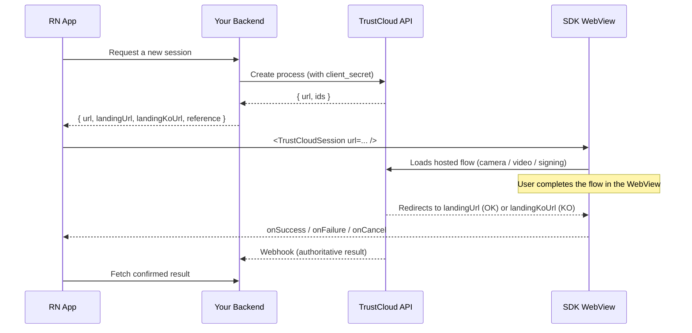

# TrustCloud React Native SDK — Overview

The `@trustcloud/react-native-sdk` package lets you embed TrustCloud / Idvia
identity and signature flows into a React Native app with minimal integration
effort. It wraps the **hosted web flows** that TrustCloud already serves, so you
get the full, always-current experience without writing native camera, liveness,
video-call, or e-signature code.

## The three flows

| Flow | Component alias | What the user does |
|------|-----------------|--------------------|
| **VideoID Unassisted** | `<VideoIdUnassistedSession>` | Scans their ID document and does a selfie/liveness check, fully self-service. |
| **VideoID Assisted** | `<VideoIdAssistedSession>` | Joins a live video call with a TrustCloud agent who verifies them. |
| **Sign** | `<SignSession>` | Reviews and signs one or more documents (standard or qualified e-signature). |

All three are the **same core component** (`<TrustCloudSession>`) under the hood —
the aliases just carry sensible defaults and flow-specific TypeScript types.

## How the wrapper works

Every TrustCloud flow follows the same server pattern: your backend creates a
process and receives a **one-time URL**; the user opens that URL to complete the
flow; the authoritative result is retrieved server-side.

The SDK's only jobs are:

1. **Render** the session URL in a hardened WebView (camera/mic permissions
   wired, cookies persisted, inline media enabled).
2. **Detect completion** by intercepting navigation to your `landingUrl` /
   `landingKoUrl`.
3. **Report** the outcome to your app via callbacks.

## Security model (read this)

- **Your TrustCloud `client_secret` never lives in the app.** The token request
  and the process-creation call happen on **your backend**. The app only ever
  receives a short-lived session URL. See
  [Backend: creating a session](backend-session-creation.md). For
  development/pilot integrations the SDK also offers an in-app client that
  embeds the credentials — see [TrustCloudClient](client.md) and its security
  warning.
- **The client-side outcome is a UX signal, not a verdict.** `onSuccess` means
  "the user reached your success landing page" — it does **not** prove the
  identity check passed. Always confirm the real result server-side via webhooks
  or the status endpoints. See [Handling results](handling-results.md).
- **Serve everything over HTTPS.** Landing URLs must be HTTPS; the WebView is
  configured to reject mixed content.

## When to use the WebView wrapper

✅ **Great fit for:**
- Getting to market fast (days, not weeks).
- One integration that behaves identically on iOS and Android.
- Always running the latest TrustCloud flow with no app release.
- **Unassisted** and **Sign** — these run flawlessly in an embedded WebView.

⚠️ **Consider carefully for:**
- **Assisted** — it uses a real-time WebRTC video call (OpenTok/Vonage). This
  works in modern system WebViews but is the most environment-sensitive path.
  The SDK supports an **in-app browser mode** (SFSafariViewController / Chrome
  Custom Tabs) for maximum compatibility. See
  [Guide: VideoID Assisted](guides/video-assisted.md#webview-vs-in-app-browser).

## Alternatives

If you need a **fully native, embedded** experience (native camera UI, offline
document capture, NFC chip reading), TrustCloud ships native Android (`.aar`) and
iOS (framework) SDKs for the two video flows. Those give a richer UX at the cost
of a larger native integration (binary distribution, license files, OpenTok
wiring, per-platform permission handling). **Sign has no native SDK** — it is
web-only on every platform.

This WebView wrapper is the fastest path and the only one that covers all three
flows with a single, small integration. Start here; graduate to native later if
a flow demands it.

## Next steps

1. [Getting started](getting-started.md) — install and render your first flow.
2. [Platform setup](platform-setup.md) — camera/mic permissions (required for the
   video flows).
3. [Backend: creating a session](backend-session-creation.md) — the server side.
4. [TrustCloudClient](client.md) — create sessions directly from the app for
   development/pilot.

## All documentation

| Doc | What it covers |
|-----|----------------|
| [Getting started](getting-started.md) | Install, peer deps, a minimal working example |
| [Example app](../example/README.md) | Runnable Expo dev-client app for all three flows, incl. WebView debugging (`EXPO_PUBLIC_WEBVIEW_DEBUG`) |
| [Platform setup](platform-setup.md) | iOS `Info.plist` + Android manifest, camera/mic permissions |
| [Backend: creating a session](backend-session-creation.md) | The server-side call that mints the session URL |
| [Guide: VideoID Unassisted](guides/video-unassisted.md) | End-to-end unassisted flow |
| [Guide: VideoID Assisted](guides/video-assisted.md) | End-to-end assisted (agent) flow |
| [Guide: Sign](guides/sign.md) | End-to-end signature flow |
| [API reference](api-reference.md) | Components, props, hooks, types, errors |
| [TrustCloudClient](client.md) | In-app session creation for development/pilot |
| [Handling results](handling-results.md) | Webhooks vs polling; why the client outcome is not authoritative |
| [Troubleshooting](troubleshooting.md) | Camera/WebRTC/cookie gotchas |
